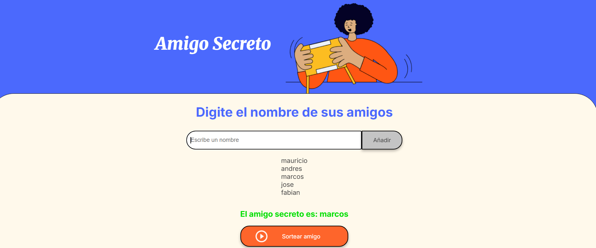

challenge amigo secreto 
Descripción del proyecto
Este proyecto es una aplicación web sencilla y divertida para sortear un "Amigo Secreto" (también conocido como "Amigo Invisible"). La interfaz de usuario es amigable y minimalista, diseñada para que cualquier persona pueda usarla fácilmente.

Características
El diseño de la aplicación destaca por:

Título claro: El nombre "Amigo Secreto" se muestra de forma prominente en la parte superior, acompañado de una ilustración moderna que representa a una persona con un libro, sugiriendo el misterio del sorteo.

Entrada de datos intuitiva: Los usuarios pueden ingresar los nombres de sus amigos uno por uno en un campo de texto ("Escribe un nombre") y añadirlos a la lista con un simple clic en el botón "Añadir".

Lista de participantes: A medida que se añaden los nombres (en la imagen se ven "mauricio", "andres", "marcos", etc.), estos se muestran en una lista clara y ordenada.

Resultado visible: Una vez que el sorteo se ha realizado, el resultado es revelado de forma directa y visible. En la imagen, se muestra "El amigo secreto es: marcos", indicando claramente el nombre de la persona seleccionada.

Botón de acción principal: Un botón destacado de color naranja con la etiqueta "Sortear amigo" es el elemento central para iniciar el sorteo, lo que guía al usuario a la acción principal del sitio.

Uso
La aplicación es ideal para sortear grupos de amigos o familiares para intercambios de regalos de forma digital, evitando la necesidad de hacerlo manualmente. Su interfaz limpia y directa garantiza una experiencia de usuario sin complicaciones.
